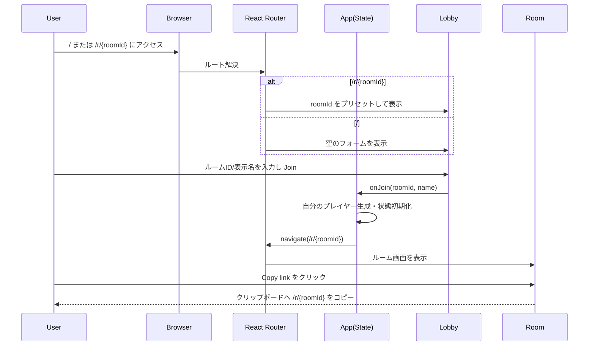
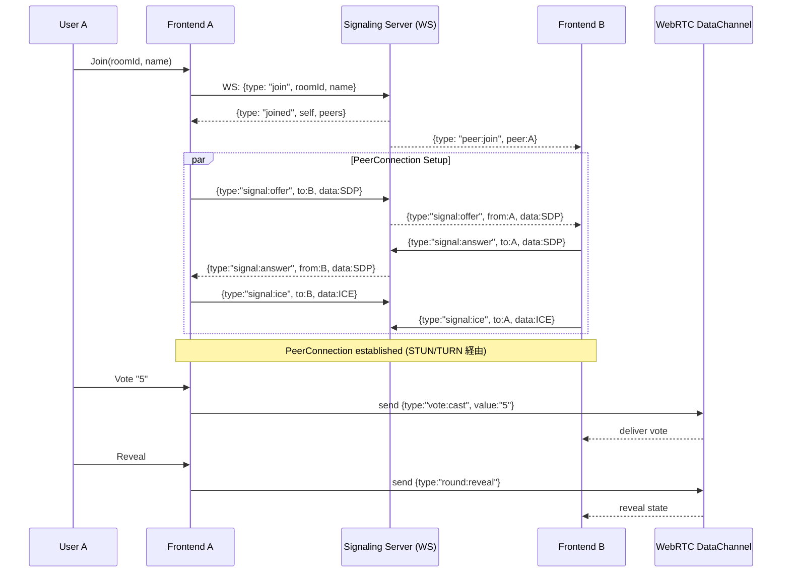

# Team Planning Poker (WebRTC-ready)

このリポジトリは、WebRTC を前提としたプランニングポーカーのフロントエンド実装（React + TypeScript + Vite）です。まずは Material UI による UI と URL 共有（React Router）を整備し、次段でシグナリング/RTCを統合する方針です。

## 概要（現状）
- UI: Material UI（テーマ適用、`ThemeProvider` + `CssBaseline`）
- 画面: ロビー（ルームID・表示名入力）、ルーム（参加者表示、デッキ選択、結果表示、招待リンクコピー）
- 共有: `/:roomId` 形式のURLでルームを共有。ルームURLへ直接アクセス時はロビーに roomId をプリセット
- 状態: 最小のローカル状態のみ（WebRTC 同期は未実装）

## アーキテクチャ（現状）
- フロントエンド: React + TypeScript + Vite
  - ルーティング: `react-router-dom`（`/` と `/r/:roomId`）
  - コンポーネント: `Lobby`（参加）、`Room`（投票・結果）
  - スタイル: MUI テーマ（`src/theme.ts`）と既存の CSS を併用
- 将来統合予定（次フェーズ）
  - シグナリング: Node + `ws` による WebSocket サーバ（`server/`）
  - P2P: WebRTC DataChannel メッシュ、型共有（`src/shared/`）

## フォルダ構成
```
.
├─ src/
│  ├─ components/
│  │  ├─ Lobby.tsx
│  │  └─ Room.tsx
│  ├─ assets/
│  ├─ App.tsx
│  ├─ main.tsx
│  ├─ theme.ts
│  ├─ index.css
│  └─ vite-env.d.ts
├─ public/
├─ AGENTS.md
├─ package.json
├─ vite.config.ts
├─ eslint.config.js
└─ tsconfig*.json
```

## コマンド
- 開発: `npm run dev`（Vite 開発サーバ）
- ビルド: `npm run build`（型チェック + `dist/` 生成）
- プレビュー: `npm run preview`
- Lint: `npm run lint`
- 備考: 将来の同時起動用に `signal`/`dev:all` スクリプトを定義済みですが、`server/index.mjs` は未実装です

## 使い方（共有）
- `/r/sprint-42` のようなURLを共有し、相手は名前入力後に Join
- ルーム画面の「Copy link」で現在の招待URLをクリップボードにコピー

## ロードマップ（次フェーズ）
- WebSocket シグナリングサーバ（`server/index.mjs`）
- WebRTC DataChannel の確立とルーム状態同期（参加/退出/投票/公開/リセット）
- ルーティングの深いリンク処理と再接続耐性
- テスト導入（Vitest + React Testing Library）

プロジェクトの運用・コーディング規約は `AGENTS.md` を参照してください。

## シーケンス図

現在のUIフロー



将来のリアルタイム同期フロー（計画）


